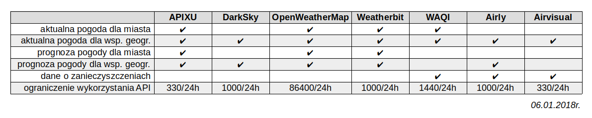

# weather2excel 
W celu wykorzystnia aplikacji należy zarejestorwać się w co najmniej jednym z 8 serwisów:
<table>
 <tr>
  <td></td>
  <td></td>
  <td></td>
  <td></td>
 </tr>
 <tr>
  <td></td>
  <td></td>
  <td></td>
  <td></td>
 </tr>
 </table>
 1. https://www.apixu.com  
 2. https://darksky.net  
 3. https://www.weatherbit.io  
 4. https://openweathermap.org  
 5. http://aqicn.org  
 6. https://www.climacell.co  
 7. https://airly.eu  
 8. https://www.airvisual.com 
 
Klucz/token do korzystania z danego API powinien zostać dopisany w odpowiednim pliku w /config/API_keys/. 
Prognozy i bieżące wyniki będą podawane w czasie UTC. Aby uzyskać je w czasie lokalnym dla wyszukiwanych miejsc, należy skonfigurować co najmniej jednen z serwisów: APIXU, DarkSky.
 Tabela przedstawiająca ogólne możliwe do wykorzystania funkcjonalności Weather API 

  
Geokodowanie odbywa się za pomocą: 

 

# Zależności:
    pip3 install unit-converter
    pip3 install --upgrade jsonpath-ng
    pip3 install requests
    pip3 install python-dateutil

# Uruchomienie
    python3 weather2excel.py

Wyjaśnienie symboli w wynikach:\
 <b>*</b>  API nie oferuje danych\
 <b>#</b>  dane chwilowo niedostępne\
 <b>_</b>  problem z konwersją danych\
 <b><</b>  wartość poniżej dopuszczalnego przedziału\
 <b>></b>  wartość powyżej dopuszczalnego przedziału
